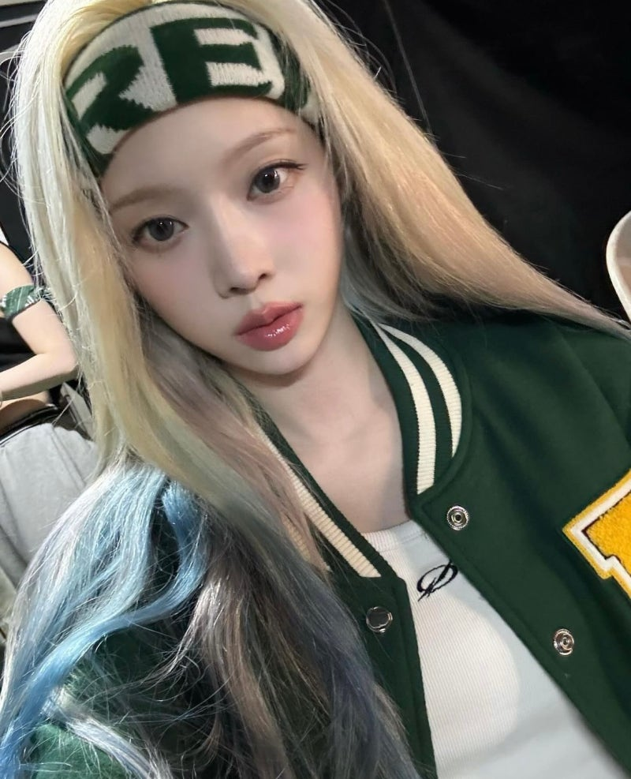
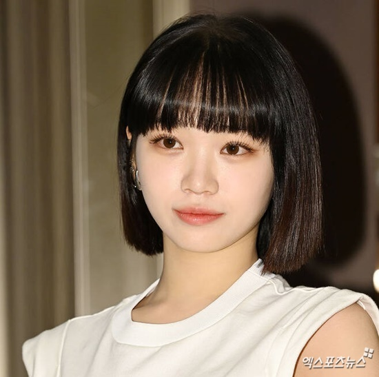
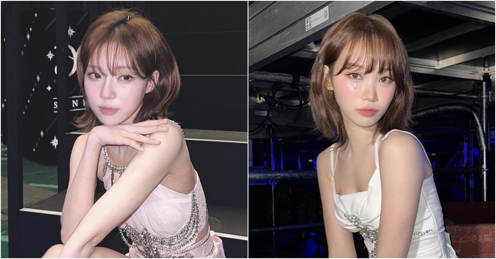
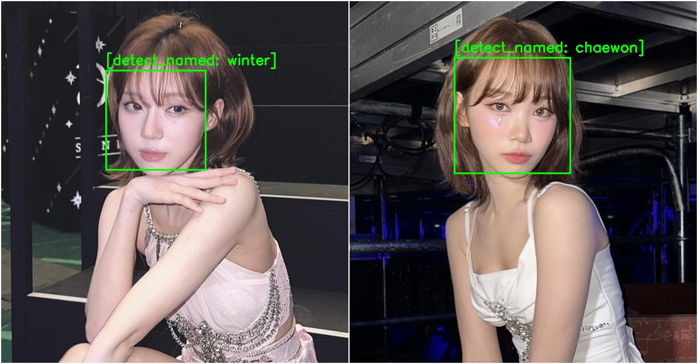

# SpaceVoice

⚠️ Since the project is still in the POC version, it tends to be quite unstable.

SpaceVoice is an AI that assists individuals with visual impairments not only in avoiding obstacles but also in experiencing beautiful landscapes alongside their loved ones—such as spouses or family—by transforming these scenes into auditory experiences, thereby fostering a deeper sense of connection and spatial awareness.

## Architecture

In the current version, we are using the Qwen2.5-VL-3B-INSTRUCT model. It is on the lighter side among VL models, and models that are overly parameter-lite may not produce satisfactory learning results. Additionally, once the next version and dataset are prepared, we plan to achieve more satisfactory outcomes through the GRPO algorithm.

For the anticipated amazing performance of GRPO, please refer to the article I wrote below. :=> (https://medium.com/stackademic/how-much-will-grpo-improve-llm-performance-1d3de8b18262)

**The main reason is the necessity for a compact LLM that can operate on portable devices with limited resources, even in environments without internet connectivity.**

- baseModel : https://huggingface.co/unsloth/Qwen2.5-3B-Instruct
- dataset : https://huggingface.co/datasets/SKyu/my-image-captioning-dataset

We are using orpheus-3b for TTS, although it does feel a bit heavy. It was selected to effectively convey emotional expressions, and we will continuously review this aspect moving forward.

- baseModel : https://huggingface.co/unsloth/orpheus-3b-0.1-ft-unsloth-bnb-4bit
- dataset : https://huggingface.co/datasets/MrDragonFox/Elise

## Below is the quality of the TTS we currently aim to provide.

https://github.com/user-attachments/assets/05ff08d7-0d9e-4b2f-b253-a5cf39b30d97

https://github.com/user-attachments/assets/3ec7ed44-64a3-4ec5-b4d1-5402efe814ef

## VL Inference

https://github.com/user-attachments/assets/fe81d20b-3ba6-473c-943f-ec319ed7814b

## RoadMap

My roadmap isn’t limited to merely updating the TTS or upgrading the model by enhancing the VL dataset. Although it isn’t feasible with the current VL dataset, I have plans to incorporate an image preprocessing process using a CNN before the VL stage. This process would learn to recognize and preprocess images of family members’ faces or those of loved ones that I want to remember, so that the LLM can perceive and describe them.

Through this approach, users will be able to experience a greater sense of empathy. Additionally, in situations where they might become separated from their family amidst a large crowd, this technology could help them locate their loved ones.

## The reason why there is the possibility of reaching the desired roadmap through image preprocessing using a CNN model.

https://github.com/user-attachments/assets/0ef068d0-2246-455f-8319-2d874417c57c

dataset: https://huggingface.co/datasets/X-ART/LeX-10K

Although this dataset is a labeled dataset for OCR, it was used for sampling because the desired approach is similar, with only differences in the descriptive expressions.

As seen in the video, the model fine-tuned using the above process was able to recognize Jessica.

This makes it possible to identify the person in front and to perform actions such as locating the trained individual, and as mentioned earlier, if a detecting bounding box is inserted through image preprocessing by the CNN before the model, the scenario can be fully realized.

## RoadMap UPDATE(2025-04-10)

|                      Training Image                      |        Label        |
| :------------------------------------------------------: | :-----------------: |
|  |    winter(aespa)    |
|  |    winter(aespa)    |
|   |    winter(aespa)    |
|  | chaewon(lesserafim) |

Since it's not feasible to use hundreds of actual family photos, we conducted tests using a small number of realistic images. As I'm Korean, I chose two popular Korean celebrities with similar appearances as the base: Winter from aespa and Kim Chaewon from LE SSERAFIM.

|         Input Image          |          Output Label          |
| :--------------------------: | :----------------------------: |
|  |  |

We can see that the analysis works well.

The current model output needs to be adjusted with a new dataset, but what remains crucial is the model’s ability to recognize and understand the given text data.
Please take a look at the overall sampling video.

https://github.com/user-attachments/assets/e31588ea-5bf2-46eb-9135-abe486a141c3

## If you want to experience the example model together, download my model from the respective Hugging Face page.

[huggingface](https://huggingface.co/devJy/space-voice-label-detect-beta)
